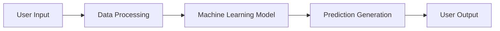
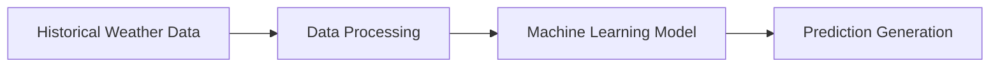
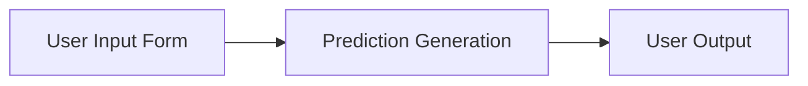

# Product Requirements Document: Crop Yield Prediction Application

## Elevator Pitch
A web application that provides personalized crop yield predictions for farmers based on historical weather data and machine learning algorithms, enabling informed decisions about planting, harvesting, and crop management.

## Executive Summary
The Crop Yield Prediction Application is designed to revolutionize farming practices by providing accurate and reliable crop yield predictions. By leveraging historical weather data and advanced machine learning algorithms, the application will enable farmers to make data-driven decisions, improving their yields and reducing losses due to adverse weather events. This solution addresses key challenges in agriculture, such as unpredictable weather impacts on crop yields, by integrating user-input farm details with predictive modeling. The application will feature a user-friendly interface, robust backend processing, and insights into weather conditions, ultimately helping farmers optimize their operations and enhance profitability.

Elaborating on the core value proposition, the application not only generates predictions but also empowers users with actionable insights. For instance, farmers can simulate different weather scenarios to understand potential impacts, reducing risks associated with climate variability. This executive summary draws from the need for precision agriculture in a market projected to grow significantly, positioning the application as a tool for sustainable farming.

## Problem Landscape
Farmers face significant challenges in predicting crop yields due to the complex interplay of weather conditions, soil quality, and crop type. Current methods for predicting crop yields are often inaccurate or unreliable, leading to losses for farmers. The Crop Yield Prediction Application aims to address this problem by providing personalized crop yield predictions, enabling farmers to optimize their farming practices and improve their bottom line.

To elaborate, traditional prediction methods rely on manual assessments or basic statistical models that fail to account for multifaceted variables like precipitation patterns, temperature fluctuations, and soil moisture levels. This results in over- or under-estimation of yields, leading to inefficient resource allocation, such as excessive fertilizer use or untimely harvesting. By incorporating machine learning, the application can process large datasets to identify patterns that human analysis might miss, offering a more nuanced and reliable forecast.

## Market Analysis
The global agricultural market is projected to reach $13.4 trillion by 2025, with the precision agriculture segment expected to grow at a CAGR of 12.2% from 2020 to 2027. The demand for crop yield prediction solutions is driven by the need for farmers to optimize their yields, reduce costs, and mitigate the effects of climate change.

This growth is fueled by increasing adoption of technology in farming, particularly in regions affected by climate variability. For example, in developing countries, smallholder farmers could benefit immensely from accessible tools like this application, potentially increasing food security and economic stability.

### Competitive Landscape
The crop yield prediction market is rapidly evolving, with several players offering solutions based on satellite imaging, weather data, and machine learning algorithms. Key competitors include:

* **Climate Corporation**: Offers a comprehensive platform for crop yield prediction and farm management.
* **Granular**: Provides a precision agriculture platform that includes crop yield prediction and farm optimization tools.
* **FarmLogs**: Offers a farm management platform that includes crop yield prediction and analytics.

Our application differentiates itself by focusing on simplicity, affordability through subscription models, and deep integration of historical data with user-specific inputs, without requiring expensive hardware like satellite subscriptions.

## Business Justification
The Crop Yield Prediction Application is expected to generate revenue through subscription-based models, with farmers paying for access to personalized crop yield predictions and insights. The application will also provide value-added services, such as weather forecasts and crop management recommendations, to further enhance the farming experience.

From a business perspective, this justifies investment due to high ROI potential: reduced crop losses could translate to billions in saved agricultural value globally. Initial monetization will target individual farmers, with expansion to consultants and researchers for broader revenue streams.

## User Avatar
* **Name**: John
* **Occupation**: Farmer
* **Goals**:
  + Improve crop yields
  + Reduce losses due to adverse weather events
  + Optimize farming practices
* **Pain Points**:
  + Inaccurate or unreliable crop yield predictions
  + Limited access to weather data and crop management insights
  + Difficulty in making informed decisions about planting, harvesting, and crop management

### User Personas
In addition to John, we have identified the following user personas:

* **Agricultural Consultant**: Provides guidance to farmers on crop management and yield optimization. Goals include accessing aggregated data for multiple farms and generating reports.
* **Farm Manager**: Oversees the day-to-day operations of the farm, including crop management and harvesting. Pain points involve real-time decision-making under uncertainty.
* **Researcher**: Studies the effects of climate change on crop yields and develops new methods for crop yield prediction. Requires advanced analytics and data export features.

## User Stories
* As a farmer, I want to input my farm details and receive personalized crop yield predictions.
* As a farmer, I want to understand the impact of different weather conditions on my crop yields.

These stories emphasize the need for intuitive interfaces and interpretable outputs, ensuring users can act on predictions without deep technical knowledge.

## Solution Architecture
The Crop Yield Prediction Application will be built using a microservices architecture, with the following components:

* **User Input Form**: Captures farm details like location, crop type, and soil conditions.
* **Data Processing**: Handles cleaning and preparation of user inputs and historical data.
* **Machine Learning Model**: Core predictive engine using algorithms like random forest regressors.
* **Prediction Generation**: Applies the model to generate outputs.
* **User Output**: Displays predictions and insights in an accessible format.

The overall flow integrates front-end user interactions with backend processing, ensuring scalability and modularity.

### Technical Specifications
* **Front-end**:
  + Built using React and Redux for dynamic, responsive interfaces.
  + Utilizes CSS and HTML for styling and layout, ensuring cross-browser compatibility.
* **Back-end**:
  + Built using Python Flask for RESTful API endpoints.
  + Utilizes Numpy and Pandas for data analysis and processing.
  + Utilizes Scikit-learn for machine learning model development and training.
* **Database**:
  + MongoDB database used to store user data, historical weather data, and crop yield predictions.
  + Collections designed to optimize data retrieval and storage, with flexible schemas for unstructured data like weather logs.
* **Libraries and Environment**:
  + Core libraries: Numpy, Pandas, Scikit-learn, PyMongo.
  + Deployment: Containerized with Docker for easy scaling.

This technical summary ensures the application is robust, efficient, and maintainable, with a focus on data-driven decision-making.

## Mermaid Diagrams
### Application Architecture


### Data Flow


### User Interaction Flow


These diagrams illustrate the high-level flows, highlighting the sequential nature of data handling and user engagement.

## Feature Specifications
The Crop Yield Prediction Application will include the following features:

* **User Input Form**: A user-friendly form that allows farmers to input their farm details, including location, crop type, and soil conditions.
* **Crop Yield Prediction Generation**: A machine learning model that generates personalized crop yield predictions based on historical weather data and user input.
* **Insights into Weather Conditions**: A feature that provides insights into the impact of different weather conditions on crop yields, enabling farmers to develop strategies for mitigating the effects of adverse weather events.

Elaborating on features, the prediction generation will include visualizations like charts showing yield trends under various scenarios, enhancing user understanding.

### Use Cases
* **Farmer**: Inputs farm details and receives personalized crop yield predictions, using insights for planning.
* **Agricultural Consultant**: Uses the application to provide guidance to farmers on crop management and yield optimization, sharing reports.
* **Researcher**: Uses the application to study the effects of climate change on crop yields and develop new methods for crop yield prediction, exporting data for analysis.

## Constraints
* **Data Quality**: The accuracy of crop yield predictions is dependent on the quality of historical weather data.
* **Model Complexity**: The machine learning model must be complex enough to capture the nuances of crop yield prediction, but simple enough to be computationally efficient.

Additional constraints include scalability for handling multiple users and compliance with data privacy regulations like GDPR for user farm data.

## Acceptance Criteria
* **Crop Yield Prediction Accuracy**: The application must achieve an accuracy of at least 80% in predicting crop yields, validated through cross-validation on test datasets.
* **User Experience**: The application must provide a user-friendly interface that is easy to navigate and understand, with load times under 2 seconds and positive usability testing feedback.

## Implementation Plan
The project will be completed within 12 weeks, with the following timeline:

* **Week 1-2**: Set up project structure and dependencies.
* **Week 3-4**: Design and implement user input form.
* **Week 5-6**: Develop machine learning model for crop yield prediction.
* **Week 7-8**: Implement prediction generation and user output.
* **Week 9-10**: Test and deploy application.
* **Week 11-12**: Monitor and maintain application.

### Task List
1. Set up the project structure and dependencies.
2. Design and implement the user input form.
3. Develop the machine learning model for crop yield prediction.
4. Implement the prediction generation and user output.
5. Test and deploy the application.

### Implementation Phases
1. Phase 1: Set up project structure and dependencies (Weeks 1-2).
2. Phase 2: Design and implement user input form (Weeks 3-4).
3. Phase 3: Develop machine learning model (Weeks 5-6).
4. Phase 4: Implement prediction generation and user output (Weeks 7-8).
5. Phase 5: Test and deploy application (Weeks 9-10).

This plan incorporates a more detailed 12-week timeline for thorough development, testing, and iteration.

## Resource Requirements
* **Development Team**: 2-3 developers with expertise in Python, React, and machine learning.
* **Data Scientist**: 1 data scientist with expertise in machine learning and data analysis.
* **Project Manager**: 1 project manager with expertise in project management and coordination.

## Success Metrics
* **Crop Yield Prediction Accuracy**: The accuracy of crop yield predictions, measured as a percentage (target: >80%).
* **User Adoption**: The number of users who adopt the application, measured as a percentage of total farmers in the target region (target: 20% in first year).
* **Revenue Growth**: The revenue generated by the application, measured as a percentage increase over time (target: 50% YoY).

## Code Snippets
### Machine Learning Model
```python
from sklearn.ensemble import RandomForestRegressor
from sklearn.model_selection import train_test_split

# Load historical weather data
weather_data = pd.read_csv('weather_data.csv')

# Split data into training and testing sets
X_train, X_test, y_train, y_test = train_test_split(weather_data.drop('yield', axis=1), weather_data['yield'], test_size=0.2, random_state=42)

# Train random forest regressor model
model = RandomForestRegressor(n_estimators=100, random_state=42)
model.fit(X_train, y_train)
```

### Prediction Generation
```python
def generate_prediction(user_input):
    # Process user input
    processed_input = pd.DataFrame([user_input])

    # Make prediction using trained model
    prediction = model.predict(processed_input)

    return prediction
```

These snippets demonstrate the core ML implementation, using Scikit-learn for efficiency.

## Edge Cases and Risk Assessments
* **Data Quality Issues**: The application may encounter issues with data quality, such as missing or inaccurate data, leading to flawed predictions.
* **Model Overfitting**: The machine learning model may overfit the training data, resulting in poor performance on new, unseen data.
* **User Adoption**: The application may not be adopted by farmers, resulting in low usage and revenue.

Additional risks include dependency on external weather data sources and potential cybersecurity vulnerabilities in the web app.

### Mitigation Strategies
* **Data Quality Checks**: Implement data quality checks to ensure that the data used to train the machine learning model is accurate and complete, including automated validation scripts.
* **Model Regularization**: Implement model regularization techniques, such as L1 and L2 regularization, to prevent overfitting, along with cross-validation.
* **User Engagement**: Implement user engagement strategies, such as user feedback mechanisms and user support, to encourage adoption and retention, including beta testing with target users.

## Future Roadmap
The Crop Yield Prediction Application will continue to evolve, with future plans to:

* **Integrate with Real-Time Weather Data**: Integrate the application with real-time weather data to provide more accurate and timely crop yield predictions.
* **Expand to Other Crops and Regions**: Expand the application to other crops and regions, increasing its global reach and impact.
* **Develop Additional Features**: Develop additional features, such as crop management recommendations and weather forecasts, to further enhance the farming experience.

This roadmap ensures long-term value, adapting to emerging technologies like AI-driven simulations.
